# LLM Efficiency & Cost Charts / 大模型效率与任务成本图

  

  <strong>优先使用可筛选、可重算的交互网页 / Start with the filterable interactive page</strong> 
  <a href="https://github.com/BIOcanse/llm-efficiency-cost-charts/releases/latest">Download the complete chart set / 下载整套成图</a>

Latest snapshot / 最新快照：**2026-07-24** 
Benchmark / 评测：**Artificial Analysis Intelligence Index v4.1** 
Coverage / 当前覆盖：**73 Token configurations / 68 API-cost configurations / 46 subscription-first configurations**

The live data page renders all three analysis plots interactively from the
current JSON snapshot, supports developer and frontier-model filters, and
recalculates API or subscription value rankings inside any selected score
interval. Chinese and English switch instantly on one URL. The static images
below remain downloadable, citable release artifacts. On this repository page,
expand the language you want below; no separate README is required.

数据页会根据当前 JSON 快照交互式绘制三张分析图，支持按厂商或各厂商最前沿模型
筛选，也可以限定分数区间后重算套餐或 API 性价比，并可在同一个 URL 内即时切换
中英文。下方静态成图仍保留为可下载、可引用的发布资产。仓库首页直接展开对应
语言即可，不再跳转到另一份 README。

<strong>English</strong>

Continuously maintained charts comparing LLM intelligence scores with total
Token consumption, API task cost, and subscription-first task cost.

Each point represents one model and reasoning level. Lines of the same color
connect reasoning levels of the same model. Higher scores and lower Token
consumption or cost are better, so the upper-left region is preferred.

## 1. Total Token consumption vs. score

Total consumption includes input, reasoning, and final-answer Tokens used to
complete the same benchmark suite.

[PNG](https://raw.githubusercontent.com/BIOcanse/llm-efficiency-cost-charts/main/charts/en/01_total_token_consumption_vs_score.png) ·
[SVG](https://raw.githubusercontent.com/BIOcanse/llm-efficiency-cost-charts/main/charts/en/01_total_token_consumption_vs_score.svg)

[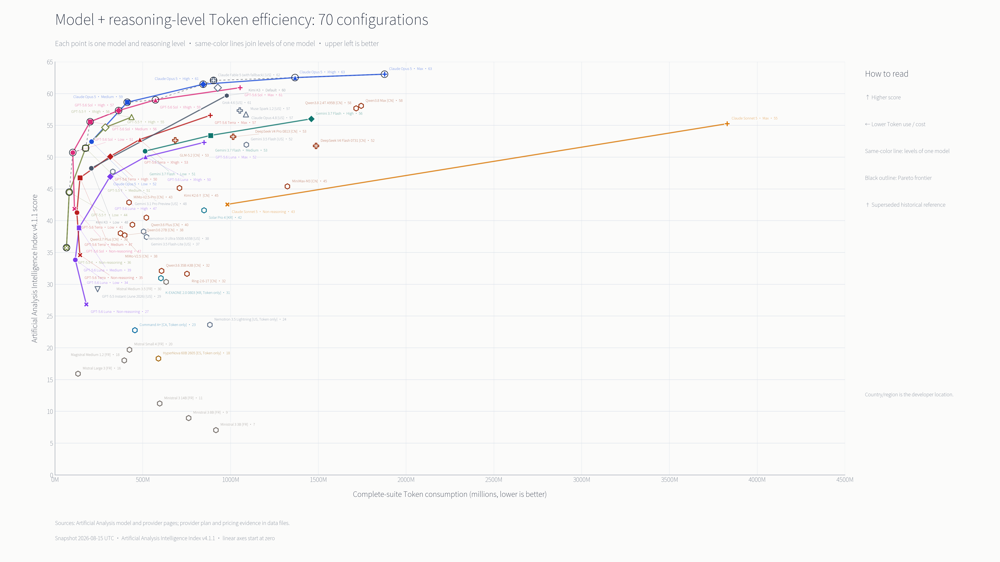](https://raw.githubusercontent.com/BIOcanse/llm-efficiency-cost-charts/main/charts/en/01_total_token_consumption_vs_score.png)

## 2. Subscription-first cost per task vs. score

The best-value applicable subscription is used when both a plan and a usable
quota estimate are available. Plans without quantifiable quota data are
excluded. API pricing is used only when no applicable subscription exists.

[PNG](https://raw.githubusercontent.com/BIOcanse/llm-efficiency-cost-charts/main/charts/en/03_subscription_first_task_cost_vs_score.png) ·
[SVG](https://raw.githubusercontent.com/BIOcanse/llm-efficiency-cost-charts/main/charts/en/03_subscription_first_task_cost_vs_score.svg)

[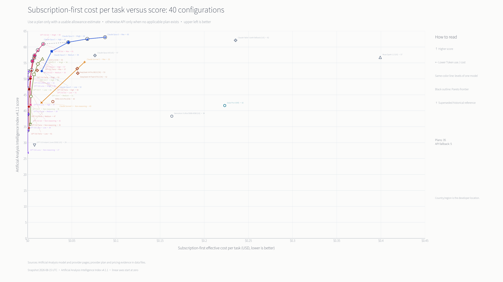](https://raw.githubusercontent.com/BIOcanse/llm-efficiency-cost-charts/main/charts/en/03_subscription_first_task_cost_vs_score.png)

## 3. API cost per task vs. score

Task cost combines the per-task Token composition with one fixed provider
price for each original model. Quantized variants are treated as separate
models only when the underlying benchmark data is sufficiently complete.

[PNG](https://raw.githubusercontent.com/BIOcanse/llm-efficiency-cost-charts/main/charts/en/02_api_task_cost_vs_score.png) ·
[SVG](https://raw.githubusercontent.com/BIOcanse/llm-efficiency-cost-charts/main/charts/en/02_api_task_cost_vs_score.svg)

[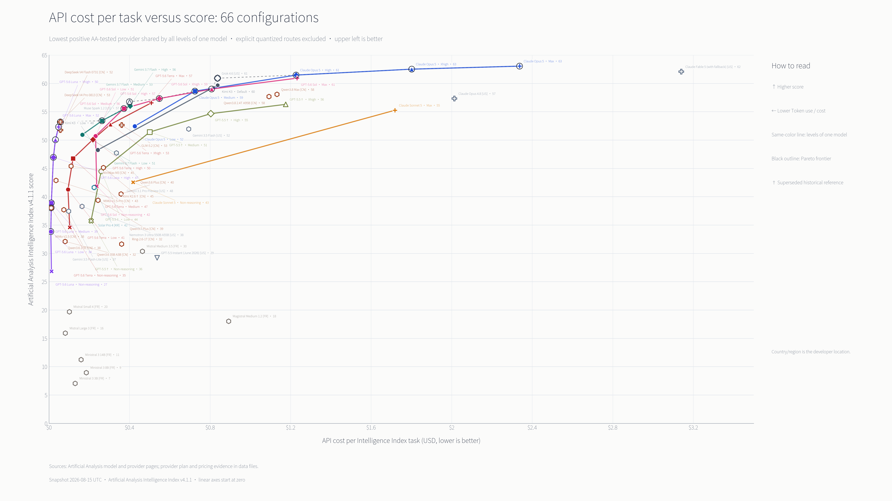](https://raw.githubusercontent.com/BIOcanse/llm-efficiency-cost-charts/main/charts/en/02_api_task_cost_vs_score.png)

## Numerical ranking graphics

Token efficiency is normalized to the current core-ranking leader = **100%**.
API and subscription-first rankings show both exact **USD per task** and the
cost percentage relative to the most expensive included configuration in the
same ranking = **100%**.

### 4. Aggregate full-curve Token efficiency

[PNG](https://raw.githubusercontent.com/BIOcanse/llm-efficiency-cost-charts/main/charts/en/04_token_efficiency_ranking.png) ·
[SVG](https://raw.githubusercontent.com/BIOcanse/llm-efficiency-cost-charts/main/charts/en/04_token_efficiency_ranking.svg)

[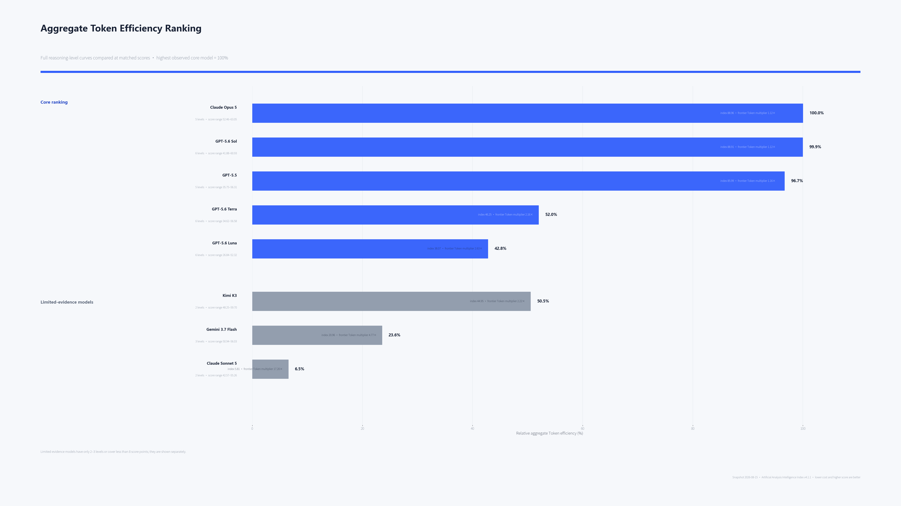](https://raw.githubusercontent.com/BIOcanse/llm-efficiency-cost-charts/main/charts/en/04_token_efficiency_ranking.png)

### 5. Subscription-first cost ranking

[PNG](https://raw.githubusercontent.com/BIOcanse/llm-efficiency-cost-charts/main/charts/en/06_subscription_cost_ranking.png) ·
[SVG](https://raw.githubusercontent.com/BIOcanse/llm-efficiency-cost-charts/main/charts/en/06_subscription_cost_ranking.svg) ·
[Complete 46-entry ranking](https://raw.githubusercontent.com/BIOcanse/llm-efficiency-cost-charts/main/charts/en/06_subscription_cost_ranking_full.png)

[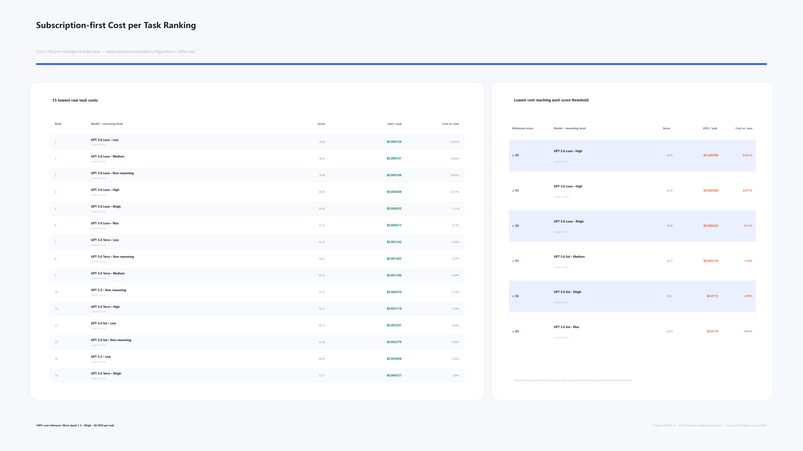](https://raw.githubusercontent.com/BIOcanse/llm-efficiency-cost-charts/main/charts/en/06_subscription_cost_ranking.png)

### 6. API cost ranking

[PNG](https://raw.githubusercontent.com/BIOcanse/llm-efficiency-cost-charts/main/charts/en/05_api_cost_ranking.png) ·
[SVG](https://raw.githubusercontent.com/BIOcanse/llm-efficiency-cost-charts/main/charts/en/05_api_cost_ranking.svg) ·
[Complete 68-entry ranking](https://raw.githubusercontent.com/BIOcanse/llm-efficiency-cost-charts/main/charts/en/05_api_cost_ranking_full.png)

[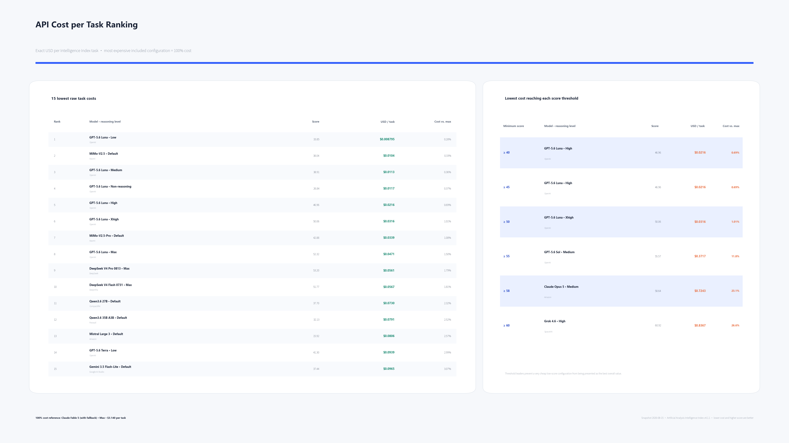](https://raw.githubusercontent.com/BIOcanse/llm-efficiency-cost-charts/main/charts/en/05_api_cost_ranking.png)

## Important limitations

- Results apply only to the same Intelligence Index v4.1 benchmark suite,
  which emphasizes relatively difficult coding and scientific tasks.
- A point measures a **model + reasoning-level configuration**, not a model
  independently of its inference budget.
- Intelligence Index scores are treated as a useful continuous comparison,
  not an exact absolute measure of intelligence.
- OpenAI and Claude subscription API-equivalent values are third-party
  estimates based on exhausting usage limits. They are not fixed Token quotas
  promised by the providers.
- Pricing, plans, benchmark results, and quota behavior can change. Every
  release is tied to a dated snapshot under [`data/`](data/).

See the [detailed chart guide](docs/CHART_GUIDE.md),
[methodology](docs/METHODOLOGY.md),
[ranking methodology](docs/RANKING_METHOD.md), [sources](docs/SOURCES.md), and
the [current data snapshot](data/2026-07-24/).

Numerical downloads:
[aggregate Token efficiency](rankings/2026-07-24/token_efficiency_ranking.csv)
· [API cost](rankings/2026-07-24/api_cost_ranking.csv) ·
[subscription-first cost](rankings/2026-07-24/subscription_cost_ranking.csv) ·
[score-threshold leaders](rankings/2026-07-24/score_threshold_leaders.csv)

<strong>简体中文</strong>

持续更新主流大模型的 Intelligence Index 跑分、完整 Token 消耗、API 单位任务成本
和套餐优先单位任务成本。

每个点代表一个模型和思考档位，同色线连接同一模型的不同档位。纵轴越高、横轴越
靠左越好。

## 1. 完整 Token 消耗与跑分

完整 Token 消耗包括完成同一套评测所需的输入、推理和最终回答 Token。

[PNG](https://raw.githubusercontent.com/BIOcanse/llm-efficiency-cost-charts/main/charts/zh-CN/01_total_token_consumption_vs_score.png) ·
[SVG](https://raw.githubusercontent.com/BIOcanse/llm-efficiency-cost-charts/main/charts/zh-CN/01_total_token_consumption_vs_score.svg)

[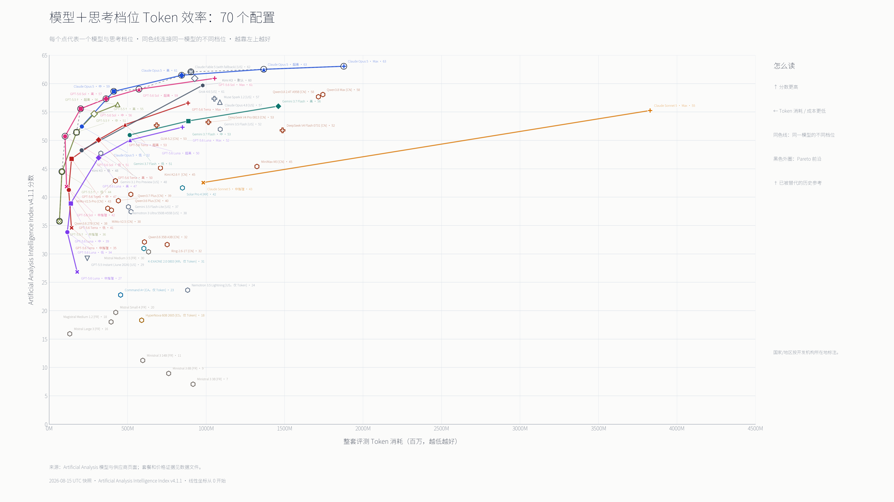](https://raw.githubusercontent.com/BIOcanse/llm-efficiency-cost-charts/main/charts/zh-CN/01_total_token_consumption_vs_score.png)

## 2. 套餐优先单位任务成本与跑分

有套餐且存在可核算额度时使用性价比最高的适用套餐；有套餐但缺少可用额度数据时
排除；只有不存在相关套餐时才使用 API。

[PNG](https://raw.githubusercontent.com/BIOcanse/llm-efficiency-cost-charts/main/charts/zh-CN/03_subscription_first_task_cost_vs_score.png) ·
[SVG](https://raw.githubusercontent.com/BIOcanse/llm-efficiency-cost-charts/main/charts/zh-CN/03_subscription_first_task_cost_vs_score.svg)

[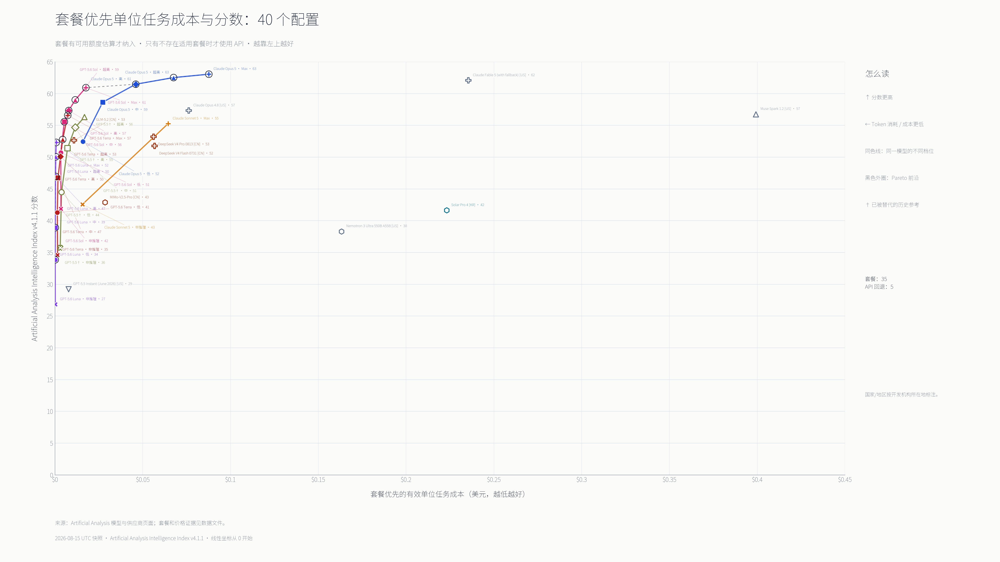](https://raw.githubusercontent.com/BIOcanse/llm-efficiency-cost-charts/main/charts/zh-CN/03_subscription_first_task_cost_vs_score.png)

## 3. API 单位任务成本与跑分

按每项任务的 Token 构成和每个原始模型统一选定的供应商价格计算。量化版本只有在
评测数据足够完整时才作为单独模型纳入。

[PNG](https://raw.githubusercontent.com/BIOcanse/llm-efficiency-cost-charts/main/charts/zh-CN/02_api_task_cost_vs_score.png) ·
[SVG](https://raw.githubusercontent.com/BIOcanse/llm-efficiency-cost-charts/main/charts/zh-CN/02_api_task_cost_vs_score.svg)

[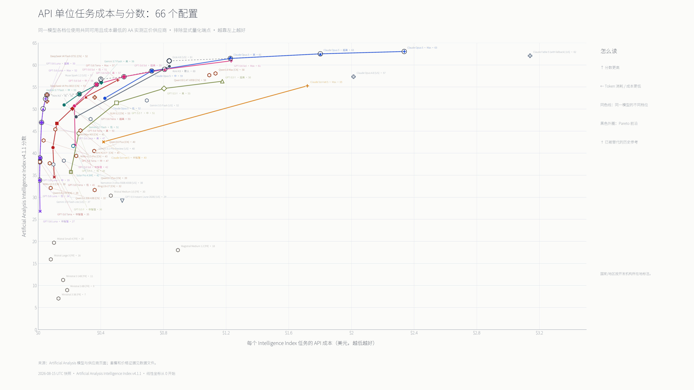](https://raw.githubusercontent.com/BIOcanse/llm-efficiency-cost-charts/main/charts/zh-CN/02_api_task_cost_vs_score.png)

## 数值排名图

综合 Token 效率以当前核心榜第一名为 **100%**。API 和套餐优先成本同时标出
**美元/任务**和相对成本百分比；各自排名中最贵的纳入配置为 **100%**。

## 4. 综合全档位 Token 效率排名

[PNG](https://raw.githubusercontent.com/BIOcanse/llm-efficiency-cost-charts/main/charts/zh-CN/04_token_efficiency_ranking.png) ·
[SVG](https://raw.githubusercontent.com/BIOcanse/llm-efficiency-cost-charts/main/charts/zh-CN/04_token_efficiency_ranking.svg)

## 5. 套餐优先单位任务成本排名

[PNG](https://raw.githubusercontent.com/BIOcanse/llm-efficiency-cost-charts/main/charts/zh-CN/06_subscription_cost_ranking.png) ·
[SVG](https://raw.githubusercontent.com/BIOcanse/llm-efficiency-cost-charts/main/charts/zh-CN/06_subscription_cost_ranking.svg) ·
[完整 46 项排名](https://raw.githubusercontent.com/BIOcanse/llm-efficiency-cost-charts/main/charts/zh-CN/06_subscription_cost_ranking_full.png)

[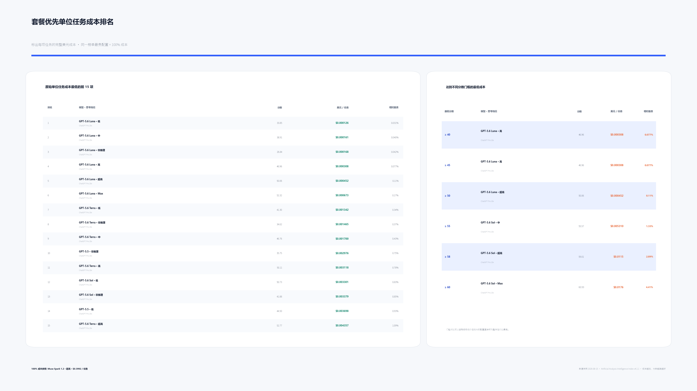](https://raw.githubusercontent.com/BIOcanse/llm-efficiency-cost-charts/main/charts/zh-CN/06_subscription_cost_ranking.png)

## 6. API 单位任务成本排名

[PNG](https://raw.githubusercontent.com/BIOcanse/llm-efficiency-cost-charts/main/charts/zh-CN/05_api_cost_ranking.png) ·
[SVG](https://raw.githubusercontent.com/BIOcanse/llm-efficiency-cost-charts/main/charts/zh-CN/05_api_cost_ranking.svg) ·
[完整 68 项排名](https://raw.githubusercontent.com/BIOcanse/llm-efficiency-cost-charts/main/charts/zh-CN/05_api_cost_ranking_full.png)

[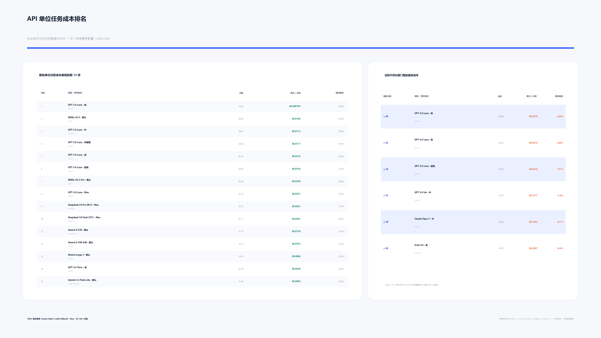](https://raw.githubusercontent.com/BIOcanse/llm-efficiency-cost-charts/main/charts/zh-CN/05_api_cost_ranking.png)

## 注意事项

- 结果只代表同一套 Intelligence Index v4.1 评测。该评测以较难的编码和科学任务为主，
  不代表所有实际使用场景。
- 每个点衡量的是**模型与思考档位的组合**，不能脱离推理预算直接视为模型本体的
  绝对效率。
- Intelligence Index 分数可以用于同口径连续比较，但不是严格的绝对智能值。
- OpenAI 和 Claude 的套餐 API 等价值来自第三方跑满限额的估算，不是厂商承诺的
  固定 Token 配额。
- 模型跑分、价格、套餐与额度行为都可能变化。每次更新均以 [`data/`](data/) 中的
  日期快照为准。

每张图的完整解释见[图片详细说明](docs/CHART_GUIDE.md)，具体计算方法见
[方法说明](docs/METHODOLOGY.md)和[排名方法](docs/RANKING_METHOD.md)，完整链接见
[数据来源](docs/SOURCES.md)，当前数据见
[2026-07-24 快照](data/2026-07-24/)。

数值下载：
[综合 Token 效率](rankings/2026-07-24/token_efficiency_ranking.csv) ·
[API 成本](rankings/2026-07-24/api_cost_ranking.csv) ·
[套餐优先成本](rankings/2026-07-24/subscription_cost_ranking.csv) ·
[分数门槛最低成本](rankings/2026-07-24/score_threshold_leaders.csv)

## Snapshot releases / 快照发布

Every snapshot keeps its own GitHub Release. The complete archive contains
both language sets of analysis and ranking graphics as 4K PNG and editable
SVG, all ranking CSV files, the dated data snapshot, documentation, and a
SHA-256 checksum.

每个日期快照都有单独的 GitHub Release。完整压缩包包含中英文分析图和排名图的
4K PNG、可编辑 SVG、全部排名 CSV、日期数据快照、说明文档和 SHA-256 校验值。

[Download the latest complete bundle / 下载最新完整套图](https://github.com/BIOcanse/llm-efficiency-cost-charts/releases/latest)

## Update policy / 更新规则

An update changes the dated data snapshot, both language chart sets, rankings,
snapshot metadata, and [`PROGRESS.md`](PROGRESS.md) together. Previous
snapshot releases remain available.

每次更新同时更新日期数据快照、中英文两套图、排名、快照日期和
[`PROGRESS.md`](PROGRESS.md)。旧版快照 Release 继续保留。
