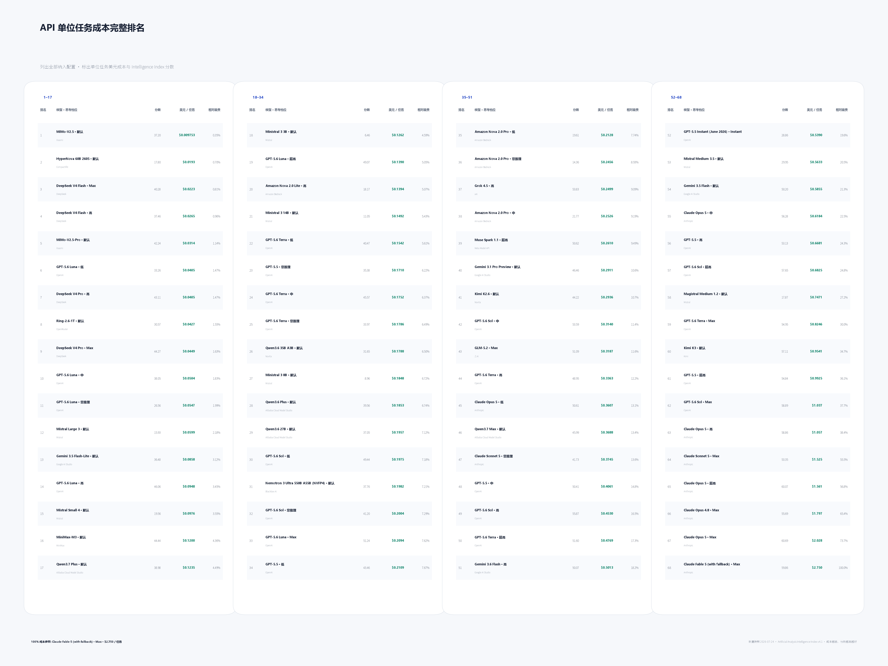
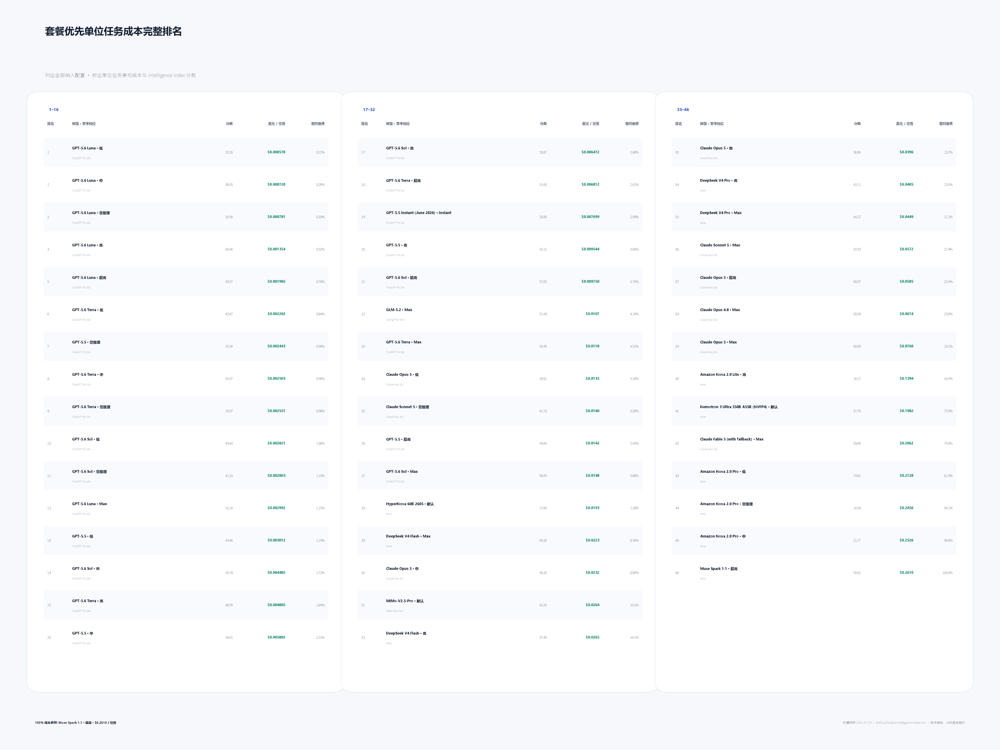
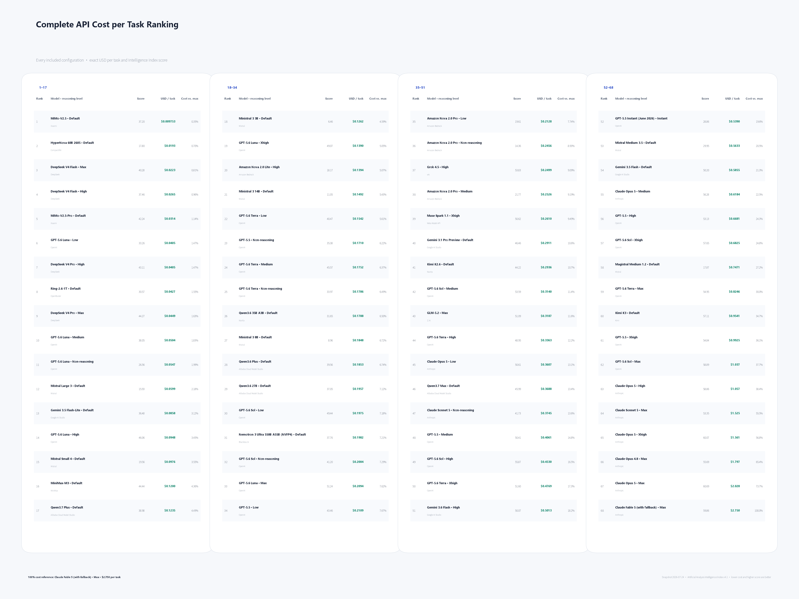
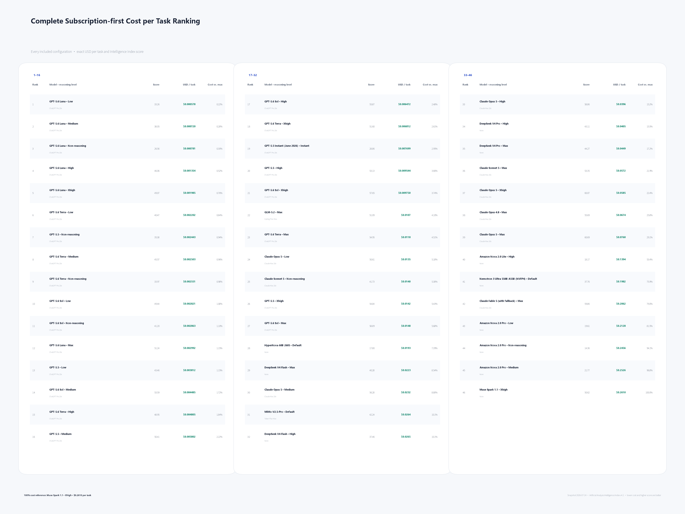

# Chart guide / 图片详细说明

Snapshot: **2026-07-24**

## 中文

### 图1：完整 Token 消耗与跑分

- 纵轴：Artificial Analysis Intelligence Index v4.1 原始分数，越高越强。
- 横轴：完成整套评测消耗的全部 Token，单位为百万，越低越省。
- 每个点：一个模型与思考档位的组合。
- 同色连线：同一模型公开的不同思考档位。
- 完整 Token：输入 Token、推理 Token 和最终回答 Token 的总和。
- 黑色外圈：当前纳入配置的 Pareto 前沿，即没有其他点能够同时使用更少 Token 并取得相同或更高分数。
- `†`：已被后续型号替代但保留作历史比较的配置。
- `仅 Token`：存在完整 Token 与跑分数据，但缺少可比的 API 成本。

该图适合比较完成同一套任务时的 Token 消耗，以及同一模型随思考预算增加形成的曲线。它不能直接说明 API 或套餐成本，因为不同模型和 Token 类型的价格不同；也不能把名称相同的 Low、Medium、High 等档位视为完全相同的推理预算。

### 图2：API 单位任务成本与跑分

- 纵轴：Artificial Analysis Intelligence Index v4.1 原始分数。
- 横轴：完成一个 Intelligence Index 任务的 API 成本，单位为美元，越低越便宜。
- 任务成本：按该配置的普通输入、缓存读写、推理和最终回答 Token 构成，乘以统一选定供应商的原始模型价格。
- 供应商规则：同一原始模型的所有思考档位固定使用同一供应商和同一价格表，避免逐档挑选不同低价供应商。
- 量化规则：量化版本不替代原模型；只有评测数据足够完整时才作为单独模型纳入。
- 当前纳入：68 个存在完整成本数据的配置。
- 当前排除：Command A+、Solar Pro 3、K2 Think V2 和 Granite 4.1 缺少可比成本。

该图回答的是“完成该套任务实际需要多少 API 费用”，同时包含 Token 单价和任务 Token 消耗。它不代表所有实际工作负载；缓存比例、输出长度和任务难度变化都会改变真实成本。

### 图3：套餐优先单位任务成本与跑分

- 纵轴：Artificial Analysis Intelligence Index v4.1 原始分数。
- 横轴：优先使用适用套餐后，完成一个 Intelligence Index 任务的有效成本，单位为美元。
- 纳入顺序：
  1. 有适用套餐且存在可核算额度时，使用性价比最高的套餐；
  2. 有相关套餐但缺少可靠额度数据时排除；
  3. 只有不存在相关模型套餐时才使用 API。
- OpenAI 与 Claude：使用第三方跑满周限额得到的 API 等价值估算，置信度为中等，不是厂商承诺的固定 Token 配额。
- Claude：只使用活动结束后的当前标准额度估算，不绘制已结束的 `+50%` 活动期历史点。
- MiMo：使用官方额度与换算规则。
- GLM：使用官方倍率和可复核的第三方额度反推。
- 标注 `API` 的点：没有适用模型套餐，按统一供应商 API 成本纳入。
- 当前排除：Grok、Gemini、Kimi、Qwen、MiniMax、Mistral 等存在套餐但额度无法可靠换算的模型。

该图适合比较“在现有套餐或 API 获取方式下，完成该套任务的有效成本”。它不是固定月度 Token 配额排名，也不代表轻量日常任务中的成本关系。

### 图4：综合全档位 Token 效率排名

- 排名综合同一模型全部已测档位的曲线，而不是挑选单个最有利的点。
- 核心榜第一名归一化为 100%，其余模型按相对效率显示百分比。
- 核心榜要求至少 4 个已测档位并覆盖 8 个分数点；数据不足的模型单列为有限样本，不参与核心排名。

[PNG](../charts/zh-CN/04_token_efficiency_ranking.png) ·
[SVG](../charts/zh-CN/04_token_efficiency_ranking.svg)

### 图5：API 单位任务成本排名

- 左侧列出成本最低的 15 个配置；右侧列出达到各分数门槛时成本最低的配置。
- 每项同时标出实际美元/任务和相对成本百分比。
- 百分比以 API 榜最贵的纳入配置为 100%，因此 20% 表示任务成本为该配置的五分之一。
- 完整图列出全部 68 个纳入配置，并保留跑分和供应商。

[概览 PNG](../charts/zh-CN/05_api_cost_ranking.png) ·
[概览 SVG](../charts/zh-CN/05_api_cost_ranking.svg) ·
[完整排名 PNG](../charts/zh-CN/05_api_cost_ranking_full.png) ·
[完整排名 SVG](../charts/zh-CN/05_api_cost_ranking_full.svg)

### 图6：套餐优先单位任务成本排名

- 左侧列出成本最低的 15 个配置；右侧列出达到各分数门槛时成本最低的配置。
- 每项同时标出实际美元/任务和相对成本百分比。
- 百分比以套餐优先榜最贵的纳入配置为 100%，只用于直观比较本榜内部成本。
- 完整图列出全部 46 个纳入配置，并保留跑分和获取方式。

[概览 PNG](../charts/zh-CN/06_subscription_cost_ranking.png) ·
[概览 SVG](../charts/zh-CN/06_subscription_cost_ranking.svg) ·
[完整排名 PNG](../charts/zh-CN/06_subscription_cost_ranking_full.png) ·
[完整排名 SVG](../charts/zh-CN/06_subscription_cost_ranking_full.svg)

## English

### Chart 1: total Token consumption versus score

- Y-axis: the raw Artificial Analysis Intelligence Index v4.1 score; higher is better.
- X-axis: all Tokens consumed by the complete benchmark suite, in millions; lower is better.
- Each point: one model and reasoning-level configuration.
- Same-color line: published reasoning levels of the same model.
- Total Tokens: input, reasoning, and final-answer Tokens.
- Black outline: the Pareto frontier among included configurations.
- `†`: a superseded configuration retained as a historical reference.
- `Token only`: complete score and Token data exist, but comparable API cost is unavailable.

Use this chart to compare complete Token consumption under one benchmark and to inspect the reasoning-level curve of one model. It does not directly measure API or subscription cost, and identically named reasoning levels do not imply identical inference budgets across providers.

### Chart 2: API cost per task versus score

- Y-axis: the raw Artificial Analysis Intelligence Index v4.1 score.
- X-axis: API cost to complete one Intelligence Index task, in USD.
- Task cost: the configuration's standard input, cache read/write, reasoning, and final-answer Token composition multiplied by the selected original-model price.
- Provider rule: one provider and one price schedule are fixed across all reasoning levels of the same original model.
- Quantization rule: a quantized endpoint never replaces the original model; it appears separately only when benchmark data is sufficiently complete.
- Included: 68 configurations with complete comparable cost data.
- Excluded: Command A+, Solar Pro 3, K2 Think V2, and Granite 4.1 lack comparable cost data.

This chart answers how much the benchmark task costs through API access, combining both Token price and Token consumption. It does not represent every workload because cache rates, answer lengths, and task difficulty change real cost.

### Chart 3: subscription-first cost per task versus score

- Y-axis: the raw Artificial Analysis Intelligence Index v4.1 score.
- X-axis: effective cost per Intelligence Index task after applying the preferred access method.
- Inclusion order:
  1. use the best-value applicable plan when a usable quota estimate exists;
  2. exclude a provider when a relevant plan exists but its quota cannot be quantified reliably;
  3. use API only when no applicable model plan exists.
- OpenAI and Claude: medium-confidence third-party API-equivalent estimates based on exhausting weekly limits, not provider-promised fixed Token quotas.
- Claude: only the current standard post-promotion estimate is plotted; the expired `+50%` promotion is removed.
- MiMo: official quota and conversion rules.
- GLM: official multiplier plus a reproducible third-party quota reconstruction.
- Points marked `API`: no applicable model subscription exists.
- Excluded: Grok, Gemini, Kimi, Qwen, MiniMax, Mistral, and others whose plan quota cannot currently be quantified reliably.

Use this chart to compare effective benchmark-task cost under current plans or API access. It is not a fixed monthly Token-quota ranking and does not describe every lightweight production workload.

### Chart 4: aggregate full-curve Token-efficiency ranking

- The ranking aggregates every observed reasoning level of a model instead of selecting one favorable point.
- The current core-ranking leader is normalized to 100%; all other models are displayed relative to it.
- The core ranking requires at least four observed levels and an eight-point score span. Models with less evidence are listed separately.

[PNG](../charts/en/04_token_efficiency_ranking.png) ·
[SVG](../charts/en/04_token_efficiency_ranking.svg)

### Chart 5: API cost-per-task ranking

- The left panel lists the 15 lowest-cost configurations; the right panel lists the lowest-cost configuration reaching each score threshold.
- Every row shows exact USD per task and relative cost.
- Relative cost is normalized to the most expensive included API configuration = 100%. A value of 20% therefore costs one fifth as much per task.
- The complete image lists all 68 included configurations with score and provider.

[Overview PNG](../charts/en/05_api_cost_ranking.png) ·
[Overview SVG](../charts/en/05_api_cost_ranking.svg) ·
[Complete PNG](../charts/en/05_api_cost_ranking_full.png) ·
[Complete SVG](../charts/en/05_api_cost_ranking_full.svg)

### Chart 6: subscription-first cost-per-task ranking

- The left panel lists the 15 lowest-cost configurations; the right panel lists the lowest-cost configuration reaching each score threshold.
- Every row shows exact USD per task and relative cost.
- Relative cost is normalized to the most expensive included subscription-first configuration = 100% and is only an internal comparison within this ranking.
- The complete image lists all 46 included configurations with score and access method.

[Overview PNG](../charts/en/06_subscription_cost_ranking.png) ·
[Overview SVG](../charts/en/06_subscription_cost_ranking.svg) ·
[Complete PNG](../charts/en/06_subscription_cost_ranking_full.png) ·
[Complete SVG](../charts/en/06_subscription_cost_ranking_full.svg)

